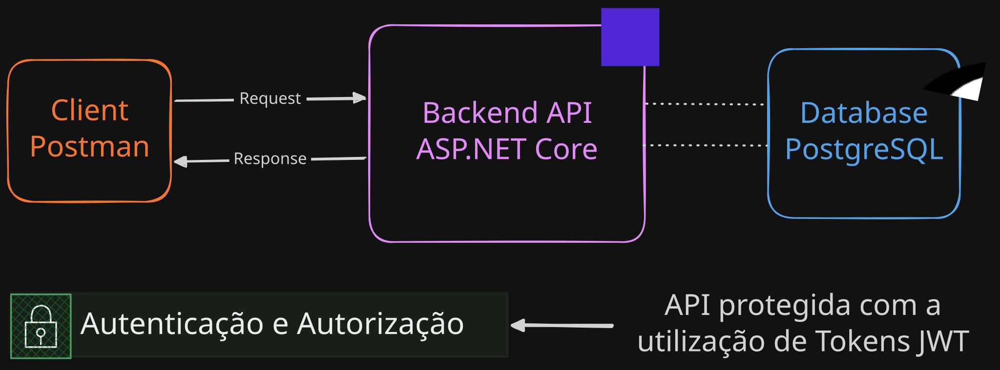
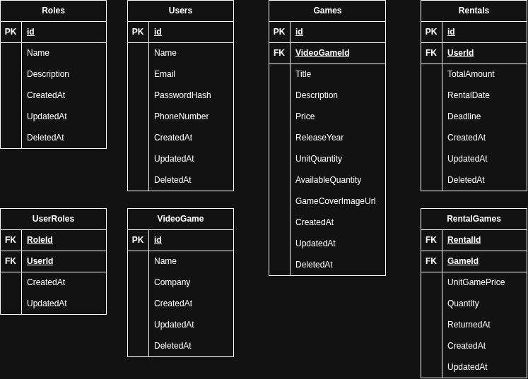

# API de locação de jogos construída com ASP.NET Core

## Status do Projeto: Em construção 🏗️

## Sobre o projeto:

API REST para locação de jogos, desenvolvida como projeto de encerramento da primeira etapa do programa de treinamento do meu estágio como Desenvolvedor Full Stack na CyberGo. A aplicação implementa autenticação e autorização baseadas em perfis (roles): usuários administradores cadastram e gerenciam o catálogo de jogos (nome, quantidade, descrição, entre outros atributos), enquanto usuários comuns gerenciam suas próprias locações pelos endpoints disponíveis.

---

## Arquitetura e Stack do projeto:

A solução foi desenvolvida em C# com .NET 10 e organizada em três projetos, com separação de responsabilidades em camadas:

- **GameRentalApi.Api:** camada de apresentação, construída com ASP.NET Core Web API. Contém os controllers, a configuração da aplicação (Program.cs), o carregamento de variáveis de ambiente com DotNetEnv e a documentação interativa dos endpoints com OpenAPI e Swagger UI (Swashbuckle).
- **GameRentalApi.Core:** camada de domínio e regras de negócio, sem dependência de infraestrutura. Concentra models, DTOs, mappings, contratos (interfaces) e services, mantendo a lógica da aplicação desacoplada da persistência.
- **GameRentalApi.Infrastructure:** camada de acesso a dados e serviços de infraestrutura. Utiliza Entity Framework Core com o provider Npgsql para persistência em PostgreSQL, com versionamento do schema via Migrations, e implementa os repositories (padrão Repository) e os contratos definidos no Core. A autenticação é feita com JWT Bearer: um TokenService emite os tokens com a role do usuário obtida diretamente do banco de dados, e um LoginService orquestra o fluxo de login. O ASP.NET Core Identity é utilizado de forma pontual, apenas para o hash seguro das senhas, por meio do PasswordHasherService.

---

## Schema da base de dados:

### Autenticação e autorização

- **Users**: armazena os usuários da aplicação (nome, e-mail, hash da senha e telefone). A senha nunca é guardada em texto puro.
- **Roles**: define os papéis do sistema, como administrador e usuário comum.
- **UserRoles**: tabela de associação entre `Users` e `Roles`. Ela permite que um usuário tenha mais de um papel e que um papel pertença a vários usuários (relação N:N).

### Catálogo

- **VideoGame**: representa o título do jogo e sua desenvolvedora/publicadora (`Company`).
- **Games**: representa o item disponível para locação, ligado a um `VideoGame`. Guarda título, descrição, preço, ano de lançamento, URL da capa e o controle de estoque: `UnitQuantity` (total de unidades) e `AvailableQuantity` (unidades disponíveis no momento).

### Locações

- **Rentals**: registra cada locação feita por um usuário, com valor total, data da locação e prazo de devolução (`Deadline`).
- **RentalGames**: tabela de associação entre `Rentals` e `Games`, já que uma locação pode ter vários jogos e um jogo pode aparecer em várias locações. Além dos IDs, guarda o preço unitário no momento da locação (`UnitGamePrice`), a quantidade e a data de devolução (`ReturnedAt`), permitindo devolver cada jogo separadamente.

### Convenções

- Todas as tabelas possuem `CreatedAt` e `UpdatedAt` para auditoria.
- A maioria possui `DeletedAt`, usado para exclusão lógica (*soft delete*): o registro é marcado como removido em vez de apagado, preservando o histórico.
- As chaves primárias são `id`; nas tabelas de associação, a chave é composta pelos dois IDs.

---